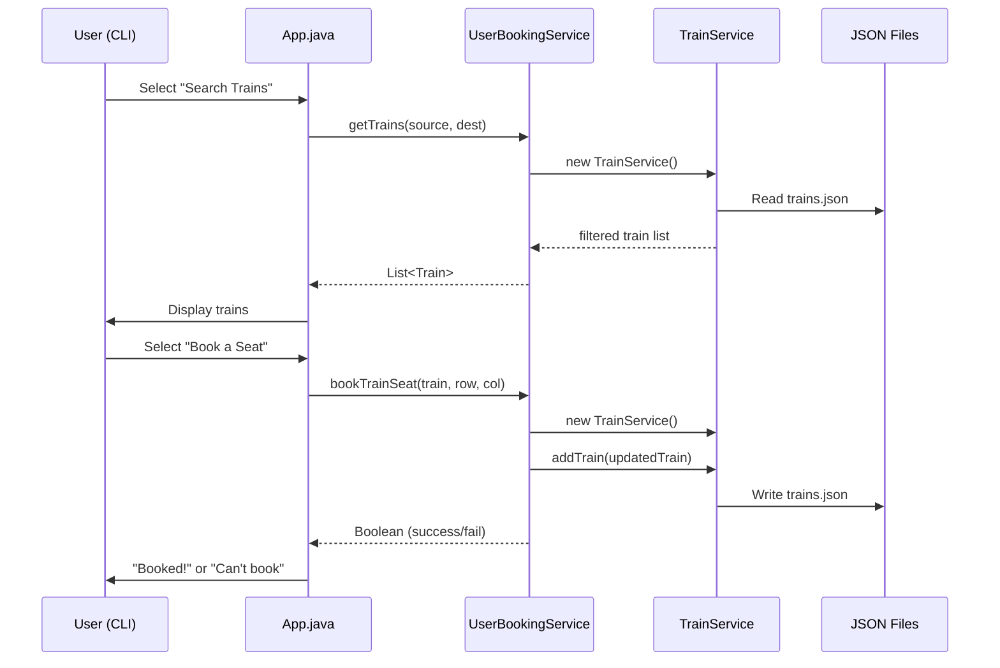

# Architecture — Train Ticket Booking System

## Overview
CLI-based train ticket booking system built with Java 8, Gradle, and JSON file-based persistence.

## Layers

```
┌─────────────────────────────────┐
│         App.java (CLI UI)       │  ← User interaction, menu loop
├─────────────────────────────────┤
│      Service Layer              │  ← Business logic
│  UserBookingService.java        │
│  TrainService.java              │
├─────────────────────────────────┤
│      Entity Layer               │  ← Data models (POJOs)
│  User.java                      │
│  Train.java                     │
│  Ticket.java                    │
├─────────────────────────────────┤
│      Util Layer                 │  ← Helpers
│  UserServiceUtil.java           │  ← Password hashing (BCrypt)
├─────────────────────────────────┤
│      Persistence (localDB/)     │  ← JSON flat files
│  users.json                     │
│  trains.json                    │
└─────────────────────────────────┘
```

## Data Flow — Book a Seat



## Tech Stack
| Component     | Technology                          |
|---------------|-------------------------------------|
| Language      | Java 8                              |
| Build Tool    | Gradle 8.5                          |
| JSON          | Jackson Databind 2.12.6             |
| Password Hash | jBCrypt 0.4                         |
| Boilerplate   | Lombok 1.18.22 (imported but underused) |
| Testing       | JUnit 4.13.2 (no tests written yet) |
| Persistence   | Local JSON files (no real DB)       |

## Key Design Decisions (to discuss)
- No database — flat JSON files as persistence
- No authentication state — login creates new UserBookingService instance but doesn't persist session
- TrainService created fresh on every operation (no singleton, no caching)
- Lombok imported but getters/setters written manually
- No input validation on Scanner inputs
- No error handling strategy — mix of try-catch, return Boolean, and swallowed exceptions
